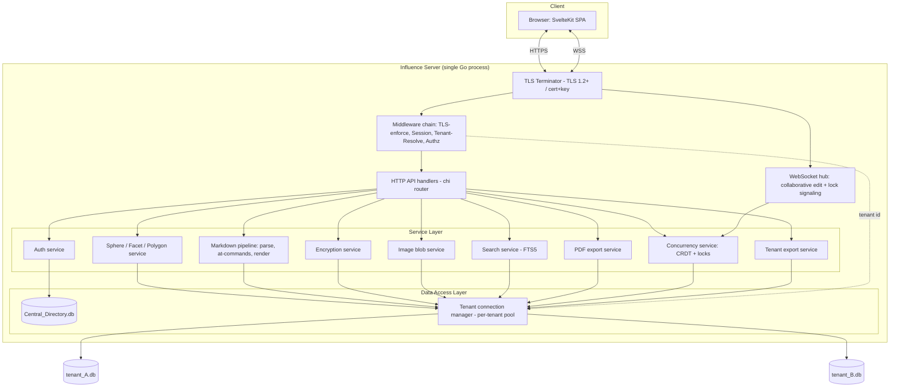
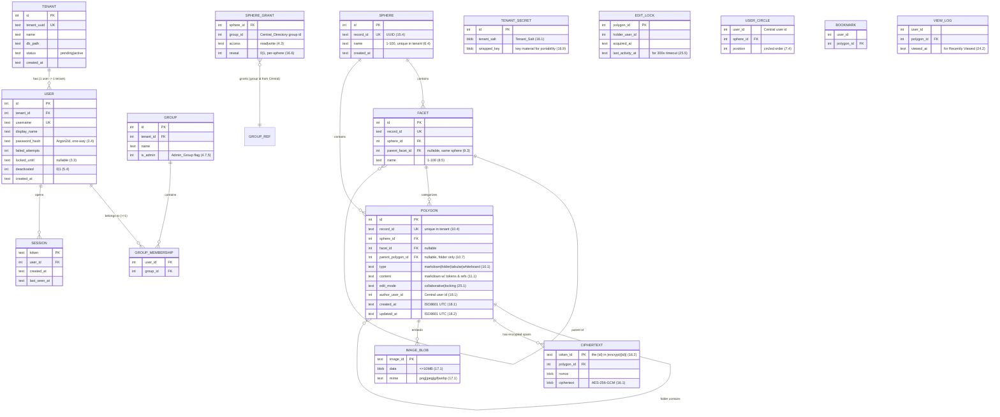
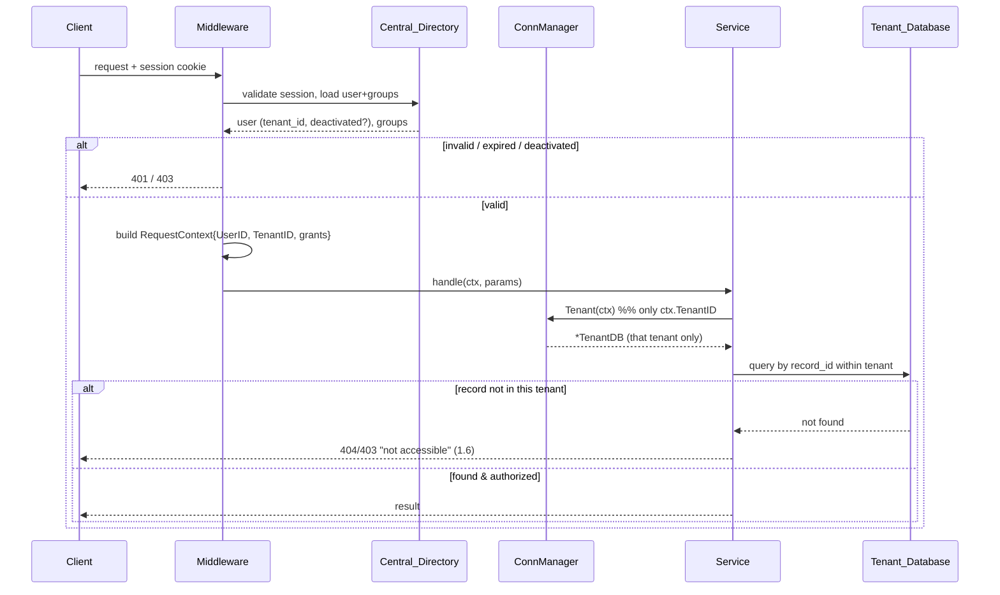
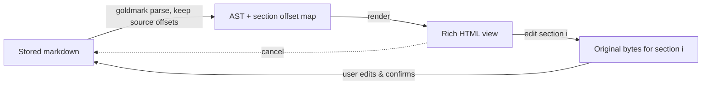
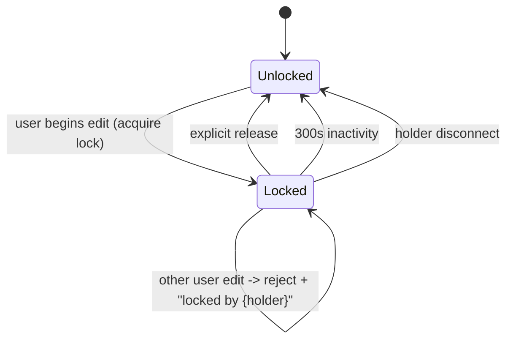

# Design Document: Influence

## Overview

Influence is a self-hostable, multitenant documentation platform for non-profits. It is a Go backend serving a SvelteKit frontend, running as a single standalone process on a Linux VM with SQLite for all persistence and TLS for transport security.

The design is shaped by three dominant forces from the requirements:

1. **Tenant portability (Req 1, 2).** Each Tenant's entire world — content, images, ciphertext, and the key material to decrypt it — lives in one self-contained SQLite file. A `Central_Directory` database holds only cross-tenant identity and a tenant registry. This "one file per org" rule drives the two-tier data model, the connection-routing layer, and the encryption-key-material placement.
2. **Stable identity with mutable names (Req 15).** Every UI-visible record (Sphere, Facet, Polygon) is addressed by an immutable `Record_ID`. URLs and links reference IDs; display names resolve at render time. This is the invariant that keeps links from breaking on rename.
3. **Sensitive data must never leak (Req 16, 22, 23).** Encryption is span-level, tenant-scoped, and reveal-gated per Sphere. Masking is enforced at every egress point — render, PDF export, and the search index — so plaintext (and ciphertext) can never escape to an unauthorized context.

The taxonomy is **Influence** (platform) > **Spheres** (workspaces) > **Facets** (hierarchical category hubs) > **Polygons** (content units, one of four types). Facets and `Folder_Polygon`s form single-parent, acyclic hierarchies.

This document specifies architecture, the two-tier data model, tenant routing, auth/authorization middleware, the encryption design, the markdown editing/rendering pipeline and `@`-command handling, image blob handling, concurrent editing (locking and collaborative), search (SQLite FTS5), PDF export, the API surface, the frontend structure, deployment/packaging, and a set of executable correctness properties.

### Technology Choices

| Concern | Choice | Rationale |
|---|---|---|
| Backend language | Go 1.22+ | Single static binary, trivial to deploy standalone (Req 20). |
| HTTP router | `net/http` + `chi` | Lightweight, middleware-friendly. |
| SQLite driver | `modernc.org/sqlite` (pure Go) or `mattn/go-sqlite3` (cgo, FTS5) | FTS5 required (Req 23); build with FTS5 enabled. |
| Frontend | SvelteKit (SPA/adapter-static or node adapter) | Requirement-specified; served by the Go binary or reverse-proxied. |
| Markdown | `goldmark` (CommonMark, extensible) | Section-level round-trip needs a parser that preserves source spans; goldmark AST + source retention supports this. |
| Encryption | AES-256-GCM, key via Argon2id / HKDF from `Tenant_Salt` | Authenticated encryption; per-tenant key isolation. |
| Real-time | WebSocket + CRDT (Yjs-compatible / Automerge-style) | Collaborative mode convergence (Req 25.2). |
| PDF | Headless-render to PDF (chromedp/rod against the app's own render route) | PDF reuses the exact rendered HTML, guaranteeing masking parity (Req 22.2). |

## Architecture

Influence runs as one OS process. TLS terminates in-process (Req 19); there is no mandatory external web server, though a reverse proxy is supported. The Go backend is organized in layers, and connection routing selects the correct SQLite database per request based on the authenticated tenant.



### Layering

- **Transport / Middleware.** TLS termination (rejecting plaintext when SSL is configured — Req 19.1, 19.2), request logging, session validation, tenant resolution, and authorization. Middleware attaches an immutable `RequestContext{UserID, TenantID, Groups, SphereGrants}` that flows to every service call.
- **API handlers.** Thin; they parse input, call a service, and shape the response. No business rules live here.
- **Service layer.** All business logic and invariants (validation, hierarchy integrity, encryption, ordering, concurrency). Services never open databases directly; they request a scoped handle from the connection manager keyed by the request's `TenantID`.
- **Data access layer.** The `Central_Directory` connection plus a per-tenant connection manager (§ Tenant Routing). A repository per aggregate wraps SQL.

### TLS / SSL termination (Req 19)

At startup the server reads cert and key paths from config. If SSL is enabled and either is missing, unreadable, or mismatched, the process fails to start with an explicit error (Req 19.4) — validated by loading the `tls.Certificate` and calling `X509KeyPair` before binding the listener. When SSL is enabled the server binds only a TLS listener with `MinVersion: tls.VersionTLS12` (Req 19.1); any plaintext HTTP listener either redirects or refuses (Req 19.2). SQLite file accessibility is likewise checked at startup; a missing/inaccessible file aborts startup (Req 20.4).

**Startup order (fail-fast before serving).** All startup validation happens in a fixed order so no partially-initialized server ever accepts traffic: (1) parse and validate config — the listen port is an integer in 1–65535 (Req 29.3) and the Data_Directory exists (Req 30.4) and is writable by the process (Req 30.5); (2) load and validate the SSL cert/key when TLS is enabled (Req 19.4); (3) confirm the `Central_Directory` and `Tenant_Database` files inside the Data_Directory are accessible (Req 20.4); (4) bind the listener on the resolved port, failing fast if that port is already in use (Req 29.4). Only after all four steps succeed does the server begin serving requests, so every fail-fast check (Req 19.4, 20.4, 29.3, 29.4, 30.4, 30.5) is enforced before any request is handled.

## Components and Interfaces

### Connection Manager (Tenant Routing) — Req 1.4, 1.5, 1.6

The single most security-critical component. It owns:

- One long-lived handle to `Central_Directory.db`.
- A map `TenantID -> *sql.DB` of per-tenant pools, opened lazily and cached (with an LRU/idle-eviction bound so thousands of tenants don't exhaust file handles).

```go
type ConnManager interface {
    Central() *sql.DB
    // Tenant returns a handle ONLY for the tenant in ctx; it is the sole
    // gateway to tenant content. Every content repository takes ctx and
    // calls this — there is no API to open an arbitrary tenant by id
    // outside the caller's authenticated tenant.
    Tenant(ctx RequestContext) (*TenantDB, error)
    CreateTenant(name string) (TenantID, error) // Req 1.7 / 1.8 transactional
    ExportTenant(id TenantID) (io.ReadCloser, error) // Req 2
}
```

The manager enforces tenant isolation structurally: content repositories receive `ctx` and can only obtain the handle for `ctx.TenantID`. A request that names a record ID not present in that tenant's DB simply finds nothing and the service returns "not accessible" (Req 1.6) — there is no code path that opens another tenant's file to satisfy a content request.

**Tenant creation (Req 1.7, 1.8)** is a saga: (1) insert a `pending` registry row in `Central_Directory`; (2) create and migrate the new SQLite file; (3) mark the registry row `active`. If step 2 fails, step 1 is rolled back (registry row removed) and an error is returned; no partial tenant remains.

**Tenant export (Req 2).** Because a tenant DB contains content, image blobs, ciphertext, `Tenant_Salt`, and wrapped key material, export is a consistent file copy (SQLite `VACUUM INTO` / online backup API to guarantee a non-locked, non-corrupt snapshot). If the file is missing, locked, or corrupt, export aborts with an error (Req 2.4). The exported file is self-sufficient (Req 2.2): a successor opens it and, with the salt + wrapped key inside, can decrypt (Req 16.9).

### Auth Service — Req 3

- **Login (3.1, 3.2).** Looks up the user in `Central_Directory`, verifies the password against a stored one-way hash (Argon2id, Req 3.4). On success, resolves the user's single tenant (Req 1.3, 1.4) and creates a session.
- **Brute-force lockout (3.3).** A per-user counter of consecutive failures; the 5th consecutive failure sets `locked_until = now + 15m`. Attempts during lockout are rejected regardless of credential correctness. A success resets the counter.
- **Sessions (3.5, 3.6).** Server-side session records with `created_at`, `last_seen_at`. A session is valid iff `now - last_seen_at <= 30m` AND `now - created_at <= 24h`. Each authenticated request slides `last_seen_at`. Logout deletes the session record (Req 3.5). A session token is an opaque high-entropy value in an HttpOnly, Secure, SameSite cookie.

### Authorization Middleware — Req 4, 5

After session validation, the middleware loads the user's Group memberships and, from those Groups, the per-Sphere grants for the user's tenant: `map[SphereID]{Access: read|write, Reveal: bool}`. Effective grant per Sphere is the union across the user's Groups (most-permissive wins for access; Reveal true if any granting Group has Reveal). `Admin_Group` membership yields an implicit grant of `write + reveal` on every Sphere in the tenant (Req 4.7) and unlocks admin pages (Req 5). Non-admins requesting an admin route get `403 admin privileges required` (Req 5.5). A deactivated user is denied all Spheres and admin pages while the account and memberships are retained (Req 5.4) — enforced by a `deactivated` check at session validation.

Authorization decisions are centralized in a `PolicyEngine`:

```go
type PolicyEngine interface {
    CanAccessSphere(ctx, sphereID) (access AccessLevel, err error) // read/write/none
    CanReveal(ctx, sphereID) bool
    IsAdmin(ctx) bool
}
```

### First-Run Bootstrap — Req 31

A tenant is in **First_Run_State** when its registry row exists but no `USER` assigned to that tenant belongs to that tenant's `Admin_Group`. A `BootstrapService` exposes two operations, both unauthenticated (there is no admin yet to authenticate as):

```go
type BootstrapService interface {
    // FirstRunState reports whether the tenant still needs a Bootstrap_Admin.
    FirstRunState(ctx, tenant TenantID) (needed bool, err error)
    // CreateBootstrapAdmin creates the first admin and clears First_Run_State.
    CreateBootstrapAdmin(ctx, tenant TenantID, username, password string) (UserID, error)
}
```

`CreateBootstrapAdmin` runs in a single Central transaction: it re-checks First_Run_State under the transaction (so two concurrent setup requests cannot both create an admin), validates the username (1–100 chars, unique in tenant) and the password against the shared password policy, hashes with Argon2id (Req 3.4), inserts the `USER`, ensures the tenant's `Admin_Group` exists, and inserts the `GROUP_MEMBERSHIP`. Once any admin exists the tenant leaves First_Run_State permanently; the setup endpoint then returns `409 SETUP_COMPLETE` (Req 31.4, 31.6). The frontend shell queries First_Run_State on load and renders the Setup_Screen instead of the login screen while it is true (Req 31.1), then falls back to normal login after a successful setup (Req 31.3).

The password policy is defined once (minimum length and basic strength) and reused by bootstrap, admin user-creation, and any future self-service password change, so Req 31.2/31.5 and 32.2 share a single validator.

### Admin & Identity API — Req 5, 32

The admin service layer already exists (`UserGroupService`: memberships, grants, effective access). This component wires it — plus user lifecycle — to HTTP handlers behind the existing middleware chain, all under the `RequireAdmin` guard except the Identity_Endpoint.

- **Identity_Endpoint `GET /api/me` (Req 32.1).** Returns the caller's `user_id`, `display_name`, `is_admin`, `two_factor_enrolled`, and (for the frontend) the `two_factor_required` policy for the tenant. Available to any authenticated session so the shell can decide what to render. Reads only from the RequestContext + a Central lookup; no tenant content.
- **User lifecycle (Req 32.2).** `GET /api/admin/users` (list users in the caller's tenant), `POST /api/admin/users` (create: username + initial password via the shared policy, added to a default Group to satisfy Req 4.1), `POST /api/admin/users/{id}/deactivate` and `.../reactivate` (toggle `USER.deactivated`, Req 5.4). Create is transactional so a failed Group assignment rolls back the user (Req 32.7).
- **Group lifecycle (Req 32.3).** `GET/POST /api/admin/groups`, `POST /api/admin/groups/{id}/members` and `DELETE .../members/{userId}` delegating to `UserGroupService.AddMembership`/`RemoveMembership`; the min-one-Group invariant (Req 4.1) surfaces as `VALIDATION` (`MIN_GROUP_MEMBERSHIP`).
- **Sphere-access matrix (Req 32.4).** `GET /api/admin/sphere-access` (list grants in the tenant), `PUT /api/admin/sphere-access` (grant: sphere + group + level + reveal) and `DELETE` (revoke), delegating to `GrantSphere`/`RevokeSphere`.

Every handler is tenant-scoped from the RequestContext, never from client input; a body referencing a user/group/sphere outside the caller's tenant is rejected with `TENANT_ISOLATION` (Req 32.6). Non-admin callers are rejected by the `RequireAdmin` guard with `ADMIN_REQUIRED` before any handler runs (Req 32.5), reusing the exact guard the tenant-admin routes already use.

### Two-Factor Authentication — Req 33

2FA is layered onto the existing login path rather than replacing it. TOTP (RFC 6238, SHA-1, 6 digits, 30-second step) is implemented with a small, well-established Go TOTP library; the QR is an `otpauth://totp/...` provisioning URI the frontend renders client-side (no image bytes stored server-side).

Enrolment (`TwoFactorService`):

```go
type TwoFactorService interface {
    BeginEnrolment(ctx, user UserID) (secret string, uri string, err error)      // Req 33.1
    ConfirmEnrolment(ctx, user UserID, totp string) (recoveryCodes []string, err error) // 33.2, 33.3
    SetTenantPolicy(ctx, rc RequestContext, required bool) error                 // 33.8 (admin)
}
```

- **Begin (33.1).** Generates a random `TOTP_Secret`, stores it as *pending* (not yet enforced) in `USER`, and returns the base32 secret + provisioning URI. The frontend shows the QR and the secret text.
- **Confirm (33.2, 33.3).** Verifies a TOTP against the pending secret; on success marks `two_factor_enrolled = 1` and generates single-use `Recovery_Code`s stored hashed (Argon2id) in `RECOVERY_CODE`. An invalid code leaves enrolment pending and returns `VALIDATION`.
- **Login integration (33.4–33.6, 33.9).** After the password verifies, if the user is enrolled the service requires a second factor before creating a session. It accepts a TOTP from the current step ±1 step for clock drift (33.9) and rejects a TOTP already consumed in its window (a per-user `last_totp_step` guards replay). A valid `Recovery_Code` is accepted once and then invalidated (33.6). Repeated second-factor failures feed the **same** `failed_attempts`/`locked_until` lockout as password failures (33.5, reusing Req 3.3).
- **Required policy (33.7, 33.8).** `TWO_FACTOR_POLICY.required` is a per-tenant flag an admin toggles. When required and the user is not enrolled, a correct password yields a **restricted session** (a session flagged `must_enrol`) that the middleware allows only to reach the enrolment and logout endpoints; every other route returns `403 ENROLMENT_REQUIRED` until enrolment completes.

The `Session` gains a `Pending2FA`/`MustEnrol` state so the login handler can return `202` ("second factor required" / "enrolment required") distinctly from `200` (fully authenticated).

### Sphere / Facet / Polygon Service — Req 6, 8, 9, 10

CRUD plus hierarchy integrity. Name validation (1–100 chars, non-empty, sphere-name uniqueness within tenant) is enforced here (Req 6.4, 8.5). Deletes cascade: deleting a Sphere removes its Facets and Polygons (Req 6.5); deleting a Facet removes descendant Facets and contained Polygons (Req 8.6). Cascades run in a single transaction.

**Hierarchy integrity (Req 9).** Facets (and `Folder_Polygon` containment) form a forest: single parent, no cycles, and — for Facets — parent must be in the same Sphere. Reparent operations validate that the proposed parent is not the node itself nor any descendant (walk ancestors of the proposed parent; reject if the node appears), rejecting with a hierarchy error and leaving state unchanged (Req 9.1, 9.3).

### Markdown Pipeline — Req 11, 12, 13, 14, 18

Covered in detail in the Markdown Editing & Rendering Pipeline section below.

### Encryption Service — Req 16

Covered in detail in the Encryption Design section below.

### Search Service — Req 23, 24

SQLite FTS5 virtual table per tenant, indexing **masked** content only (§ Search). Quick searches: "Polygons I've Created" (authored, accessible, newest-first — Req 24.1) and "Recently Viewed Polygons" (per-user view log, up to 50, newest-first — Req 24.2).

### Concurrency Service — Req 25

Per-Polygon mode: collaborative (CRDT over WebSocket) or record-locking. Detailed below.

## Data Models

Two tiers. `Central_Directory` holds identity and the tenant registry and **no content** (Req 1.1, 1.2). Each `Tenant_Database` holds everything for one tenant (Req 2.1, 2.3).

### Record_ID strategy (Req 15.4, 15.5)

Every UI-visible record (Sphere, Facet, Polygon) carries a `record_id`: a UUIDv4 stored canonically, with a Short-UUID (base57 of the same 128 bits) as the URL-facing form. IDs are assigned at creation, never change (Req 15.5), and are unique within the tenant DB per record type (uniqueness enforced by a UNIQUE column; global UUID uniqueness makes cross-type collisions negligible). URLs are `/{sphereShortId}/{polygonShortId}`; links store `record_id` and resolve to the current name at render (Req 15.1–15.3). Internal foreign keys use integer surrogate `id` for efficiency; `record_id` is the external contract.



### Notes on placement decisions

- **User↔Tenant is 1:1-from-the-user-side (Req 1.3):** `USER.tenant_id` lives in `Central_Directory`; login uses it to pick the tenant DB.
- **Grants, circling, bookmarks, view log, locks live in the Tenant DB** even though they reference a Central `user_id`/`group_id`. This keeps per-tenant, per-user state inside the portable file so an exported tenant carries its own access map and personalization. The referenced Central IDs are stable integers; on hand-off the successor re-creates matching users or remaps IDs during import.
- **`TENANT_SECRET` holds `Tenant_Salt` and wrapped key material inside the tenant file (Req 2.2, 16.9)**, which is what makes ciphertext decryptable after export.
- **Ciphertext and images are blobs in the tenant DB (Req 2.1, 16, 17.1)** — no external store.
- **FTS5 index** is a virtual table `polygon_fts(content)` in the tenant DB, populated with masked content (§ Search).

### Schema additions for bootstrap, admin API, and 2FA (Req 31, 32, 33)

These extend the **Central_Directory** only; tenant content schema is unchanged.

- **`USER` new columns (all nullable / defaulted, so existing rows migrate cleanly):**
  - `two_factor_secret TEXT` — pending or active TOTP_Secret (base32), NULL when never enrolled (Req 33.1).
  - `two_factor_enrolled INTEGER NOT NULL DEFAULT 0` — 1 once a TOTP has been confirmed (Req 33.2).
  - `last_totp_step INTEGER` — the most recently consumed TOTP time-step, to reject replay within a window (Req 33.9).
- **`RECOVERY_CODE`** — `(id PK, user_id FK, code_hash TEXT, used INTEGER NOT NULL DEFAULT 0)`. Single-use backup codes stored as Argon2id hashes; `used` flips to 1 on redemption (Req 33.2, 33.6).
- **`TWO_FACTOR_POLICY`** — `(tenant_id PK FK, required INTEGER NOT NULL DEFAULT 0)`. Per-tenant optional/required flag toggled by an admin (Req 33.7, 33.8). Absence of a row means optional.
- **`SESSION` new column:** `state TEXT NOT NULL DEFAULT 'active'` with values `active` | `pending_2fa` | `must_enrol`, so the middleware can gate a half-authenticated session to only the second-factor / enrolment / logout routes (Req 33.4, 33.7).
- **First_Run_State needs no new column** — it is derived: a tenant is in First_Run_State iff no `USER` with that `tenant_id` is a member of that tenant's `is_admin` Group. The bootstrap transaction checks this predicate directly (Req 31).

Schema changes are applied by the existing Central migration path; each new column is additive and defaulted so the change is backward compatible with an already-populated Central_Directory.

## Tenant Routing and Connection Management

Flow for a content request (Req 1.4–1.6):



Isolation is enforced structurally (the service can only fetch its own tenant's handle) and defensively (record lookups are always scoped by the tenant's own DB). There is no query that spans two tenant files.

## Request / Authorization Middleware

The chain, in order:

1. **TLS-enforce** (Req 19.2): reject/redirect plaintext when SSL configured.
2. **Session** (Req 3.5, 3.6): validate token, slide inactivity, reject expired.
3. **Tenant-resolve** (Req 1.4): attach `TenantID` from the user record.
4. **Authz** (Req 4, 5): load grants; for Sphere-scoped routes check `CanAccessSphere`; for admin routes check `IsAdmin`; attach `CanReveal` per Sphere for downstream masking decisions.

Downstream services trust `RequestContext` and never re-derive tenant from client input.

## Encryption Design (Sensitive-Data Obfuscation) — Req 16

### Key derivation and cipher

Each tenant has a random 128-bit `Tenant_Salt` generated at tenant creation and stored in `TENANT_SECRET` inside the tenant DB (Req 16.1). A tenant-scoped **data key** is derived once and wrapped for storage:

- A random 256-bit Data Encryption Key (DEK) is generated at tenant creation.
- The DEK is used with **AES-256-GCM** to encrypt sensitive spans (authenticated encryption; GCM tag detects tampering/corruption for Req 16.8).
- The DEK is wrapped (encrypted) with a Key-Encryption-Key (KEK) derived via **Argon2id** from a server master secret salted with `Tenant_Salt`, and the wrapped DEK is stored in `TENANT_SECRET.wrapped_key`.

Because both `Tenant_Salt` and `wrapped_key` live inside the tenant DB, the exported file is decryptable on a successor host that possesses (or is given) the server master secret, or — for a fully standalone hand-off — the export can re-wrap the DEK under a passphrase the successor supplies. Either way, tokens remain decryptable after import (Req 16.9, 2.2).

### Encrypt flow (Req 16.1, 16.2)

```mermaid
sequenceDiagram
    participant U as User (selects span, clicks encrypt)
    participant ENC as Encryption Service
    participant TDB as Tenant_Database

    U->>ENC: encrypt(polygonID, span plaintext)
    ENC->>TDB: load Tenant_Salt + wrapped DEK
    ENC->>ENC: unwrap DEK; nonce=random(96b); ct=AES-GCM(DEK,nonce,plaintext)
    ENC->>ENC: token_id = new unique id
    ENC->>TDB: INSERT CIPHERTEXT(token_id, nonce, ct)
    ENC->>TDB: replace span in POLYGON.content with |encrypt|{token_id}|
    ENC-->>U: updated content (no plaintext retained) (16.2)
```

No plaintext copy is kept in `POLYGON.content` — only the `|encrypt|{id}|` token, which maps to the row in `CIPHERTEXT` (Req 16.2).

### Reveal flow (Req 16.3, 16.4, 16.5, 16.8)

Rendering always starts from stored content that contains tokens. For a viewer **without** Reveal_Permission for the Sphere, each token is replaced by a masked placeholder (e.g. `🔒 hidden`) and neither plaintext nor ciphertext is ever placed in the output (Req 16.3). For a viewer **with** Reveal_Permission, tokens still render masked by default; the viewer requests reveal for a single token, and the service — after re-checking `CanReveal(sphere)` — decrypts just that token and returns its plaintext, leaving every other token masked (Req 16.4). A reveal request from a user lacking permission is denied, content stays masked, and a "not permitted" response is returned (Req 16.5). If a token's ciphertext is missing or GCM authentication fails, reveal fails, content stays masked, and no partial plaintext is exposed (Req 16.8). Reveal is strictly per-Sphere (Req 16.6): the permission check is keyed by the token's owning Polygon's Sphere.

### Masking at every egress (Req 16.7, 22.2, 23.2)

A single `Masker` component is the only thing that turns tokens into output, and it takes a `reveal bool` derived from the request context. Render, PDF export, and search-index population all route through the same masking step:

- **Render:** masked unless per-token reveal (above).
- **PDF export:** PDF is produced from the app's own rendered HTML for the requesting user, so it inherits masking; a non-reveal user's PDF contains only placeholders (Req 22.2).
- **Search index:** the FTS5 row is built from **masked** content, so plaintext is never indexed and cannot match or appear in results for a non-reveal context (Req 16.7, 23.2). Ciphertext is likewise excluded from the index.

This centralization is what makes the "plaintext never leaks" property testable at one seam rather than scattered across features.

## Markdown Editing and Rendering Pipeline — Req 11, 12, 13, 14, 18

### Storage model

`Markdown_Page` content is stored as markdown text (Req 11.1). The text contains ordinary CommonMark plus three inline encodings the platform understands:

- Cross-Refraction links and internal links: `[label](influence://polygon/{record_id})` — stored by Record_ID (Req 14.1, 15.1).
- External links: `[label](https://…)` — validated scheme, 1–2048 chars (Req 13).
- Obfuscation tokens: `|encrypt|{id}|` inline (Req 16.2).
- Image references: `` (Req 17.1).
- `@`-command directives persist where they represent authored intent (`@toc`, `@children` persist as directives and regenerate at render; `@link`/`@heading` are authoring aids that resolve to markdown at insert time).

### Section-level round-trip (Req 12.3)

The editor works section-by-section. A **section** is a contiguous span of the stored markdown delimited by heading boundaries. The pipeline retains, for each rendered section, the exact byte range of its source in the stored markdown. When a user opens a rendered section for editing without changing it, the editor is handed the original bytes for that range verbatim — guaranteeing a byte-for-byte round-trip (Req 12.3). Cancelling an edit discards the buffer and leaves stored bytes untouched (Req 12.4). This is achieved by never round-tripping through a lossy AST for the "view→edit" direction: rendering is AST→HTML for display, but the edit buffer is sourced from retained source offsets, not re-serialized from the AST.



### `@`-command handling (Req 11)

| Command | Time | Behavior |
|---|---|---|
| `@link` | edit-time | Presents a selectable list of other Polygons in the tenant (Req 11.2); empty list with indicator if none (Req 11.3). Selection inserts an `influence://polygon/{id}` link. |
| `@heading` | edit-time | Presents heading-style choices (Req 11.4); inserts markdown heading. |
| `@toc` | render-time | `Rich_Renderer` generates a TOC from the current page's headings (Req 11.5); empty TOC if no headings (Req 11.6). |
| `@children` | render-time | Generates a list of the current Polygon's child Polygons (Req 11.7); empty list if none (Req 11.8). |

`@toc`/`@children` are **dynamic**: whenever the page's heading set or the Polygon's child set changes, the renderer regenerates them (Req 11.9). They are stored as directives, not baked output, so they always reflect current structure. Each `@`-command also has an on-screen icon in the editor toolbar in addition to the typed form (Req 11.10).

### Link rendering

- **External (Req 13.3):** rendered as an activatable anchor to the stored URL. Insert-time validation rejects empty, >2048-char, or non-web-scheme URLs, preserving content and showing an error (Req 13.2).
- **Cross-Refraction (Req 14):** at render the Record_ID is resolved. If the target exists and is accessible, show the target's **current** name as an activatable link (Req 14.2, 15.3). If the target was deleted, render non-activatable with "target unavailable" (Req 14.3). If the target is in a Sphere the viewer can't access, render non-activatable, withhold the name, and indicate "inaccessible" (Req 14.4).

### Metadata footer (Req 18)

On create, the author's Central user id and creation timestamp (ISO 8601 UTC) are recorded (Req 18.1); each edit updates `updated_at` (Req 18.2). Render appends a footer with author **display name** (resolved from Central at render), creation date, and last-edit date, each as ISO 8601 UTC dates (Req 18.3).

## Image Blob Handling — Req 17

On paste, the client sends bytes + declared MIME. The server sniffs the actual content type and validates it is PNG/JPEG/GIF/WebP (Req 17.2) and size ≤ 10 MB (Req 17.3); on failure the paste is rejected, content is unchanged, and a specific error (unsupported format vs too large) is shown. On success the image is stored as a blob in `IMAGE_BLOB` with a new `image_id`, and an `influence://image/{image_id}` reference is inserted into the content (Req 17.1). At render the reference resolves to a data/stream URL served from the blob (Req 17.4); an unresolvable reference renders a placeholder (Req 17.5). Blobs live in the tenant DB, keeping the file self-contained (Req 2.1).

## Concurrent Editing — Req 25

Each Polygon is in exactly one mode, recorded in `POLYGON.edit_mode` (Req 25.1). The two modes are mutually exclusive and never mixed for the same Polygon.

### Collaborative mode (Req 25.2)

Editors connect over WebSocket to a per-Polygon room in the WS hub. Edits are represented as **CRDT** operations (a text CRDT such as RGA/Yjs-style sequence) so concurrent edits merge without conflict and converge. The hub broadcasts each local change to all other connected editors; propagation completes well within the 5-second bound (Req 25.2). The server periodically snapshots the converged document to `POLYGON.content`. CRDT (over OT) is chosen because it converges without a central transform authority and tolerates the intermittent connectivity typical of small self-hosted deployments.

### Record-locking mode (Req 25.3, 25.4, 25.5)



When a user begins editing, the server acquires an `EDIT_LOCK` for that Polygon (Req 25.3). A different user attempting to edit/save is rejected and told the Polygon is locked and by whom (Req 25.4). The lock releases on explicit release, after 300 s of holder inactivity, or on holder disconnect (Req 25.5) — inactivity tracked via `last_activity_at`, disconnect via the WebSocket close/heartbeat.

## Search — Req 23, 24

Per-tenant SQLite **FTS5** virtual table `polygon_fts` indexing `record_id` and **masked** content. Because indexed text is already masked (§ Encryption), sensitive plaintext is never in the index and cannot match or surface for a non-reveal context (Req 23.2, 16.7). Queries are scoped to the Spheres the user can access (Req 23.1) by joining candidate Polygons against the user's Sphere grants; no match yields an empty set (Req 23.3).

For reveal-capable users, an optional second index or on-the-fly decrypt-and-match path may be added later; the baseline design keeps a single masked index to guarantee non-leakage, which is the property that must hold.

**Quick searches (Req 24):**
- *Polygons I've Created:* `POLYGON` where `author_user_id = user`, scoped to accessible Spheres, ordered `created_at DESC` (Req 24.1).
- *Recently Viewed:* `VIEW_LOG` for the user, scoped to accessible Spheres, distinct Polygons, newest first, capped at 50 (Req 24.2).
- Empty result sets when nothing matches (Req 24.3).

## PDF Export — Req 22

The export service renders the target Polygon through the same rendering route the app uses, for the requesting user's context, into a print-only layout that omits toolbars and menus, then converts that HTML to PDF via a headless renderer (Req 22.1). Because it reuses the app's render + `Masker`, masking is automatic: a user without Reveal_Permission gets masked placeholders in the PDF (Req 22.2). If generation fails, no file is produced and an error is returned (Req 22.3).

## API Surface

REST over HTTPS; WebSocket for realtime. All content routes run through the middleware chain and are tenant-scoped by session.

| Method & path | Purpose | Reqs |
|---|---|---|
| `POST /api/auth/login` | Authenticate (password, then TOTP/recovery if enrolled), create session | 3.1–3.4, 33.4–33.6 |
| `POST /api/auth/logout` | Terminate session | 3.5 |
| `GET /api/spheres` | List accessible Spheres (circled first, then alpha) | 7, 21 |
| `POST /api/spheres` | Create Sphere | 6.2, 6.4 |
| `DELETE /api/spheres/{id}` | Delete Sphere + contents | 6.5 |
| `POST /api/spheres/{id}/circle` / `DELETE .../circle` | Circle / un-circle | 7.1, 7.6 |
| `PUT /api/circles/order` | Reorder circled list | 7.4 |
| `GET/POST/PATCH/DELETE /api/facets` | Facet CRUD + reparent | 8, 9 |
| `GET/POST/PATCH/DELETE /api/polygons` | Polygon CRUD | 10 |
| `GET /api/polygons/{id}/render` | Rendered HTML (masked per ctx) | 12, 14, 16.3, 18 |
| `POST /api/polygons/{id}/encrypt` | Encrypt a span | 16.1, 16.2 |
| `POST /api/polygons/{id}/reveal/{tokenId}` | Reveal one token | 16.4, 16.5, 16.8 |
| `POST /api/polygons/{id}/images` | Paste image blob | 17 |
| `GET /api/images/{imageId}` | Serve image blob | 17.4, 17.5 |
| `GET /api/polygons/{id}/pdf` | PDF export | 22 |
| `GET /api/search?q=` | Search | 23 |
| `GET /api/quick/created` / `GET /api/quick/recent` | Quick searches | 24 |
| `POST /api/polygons/{id}/lock` / `DELETE .../lock` | Acquire / release lock | 25.3, 25.5 |
| `WS /ws/polygons/{id}` | Collaborative edits / lock signaling | 25.2 |
| `GET/POST /api/bookmarks` / `DELETE /api/bookmarks/{polygonId}` | Bookmarks | 26 |
| `GET /api/setup/state` / `POST /api/setup/admin` | First-run: check state, create Bootstrap_Admin | 31 |
| `GET /api/me` | Current user identity + permissions + 2FA status | 32.1 |
| `GET/POST /api/admin/users`, `POST /api/admin/users/{id}/deactivate|reactivate` | Admin: user list/create/(de)activate | 5.1, 5.4, 32.2 |
| `GET/POST /api/admin/groups`, `POST /api/admin/groups/{id}/members`, `DELETE .../members/{userId}` | Admin: group + membership management | 5.2, 32.3 |
| `GET /api/admin/sphere-access`, `PUT` / `DELETE /api/admin/sphere-access` | Admin: per-Sphere Group grant matrix | 5.3, 32.4 |
| `POST /api/2fa/enrol`, `POST /api/2fa/confirm` | Begin/confirm TOTP enrolment (QR provisioning) | 33.1, 33.2 |
| `PUT /api/admin/2fa-policy` | Admin: set tenant 2FA optional/required | 33.8 |
| `POST /api/admin/tenants` | Create tenant | 1.7, 1.8 |
| `GET /api/admin/tenants/{id}/export` | Export tenant DB | 2 |
| `GET /api/docs/{path}` | In-app documentation | 27 |

Standard error envelope: `{ "error": { "code": "...", "message": "..." } }` with codes like `TENANT_ISOLATION`, `VALIDATION`, `HIERARCHY`, `REVEAL_DENIED`, `LOCKED`, `ADMIN_REQUIRED`, `SETUP_COMPLETE`, `ENROLMENT_REQUIRED`, `SECOND_FACTOR_REQUIRED`.

## Frontend Structure (SvelteKit)

- **Shell / layout:** top bar (search, quick searches, bookmarks menu, user menu) + left menu.
- **Left menu (Req 21):** Sphere list — circled group (reorderable, drag handles) above alphabetical remainder (Req 7.3, 7.5). Selecting a Sphere expands its Facet/Polygon tree; empty Sphere shows an empty-contents indicator (Req 21.3).
- **Polygon views:** type-specific — `MarkdownPage` (rich view + section editor), `FolderPolygon` (children list, supports `@children`), `TabularPolygon` (grid), `WhiteboardPolygon` (canvas).
- **Markdown editor component:** section-based editing, `@`-command menu + toolbar icons (Req 11.10), image paste handler, encrypt-selection action, reveal-token control.
- **Admin section:** Users, Groups, Sphere-access matrix (access level + Reveal per Group per Sphere) — visible only to Admin_Group (Req 5).
- **Setup screen (Req 31):** shown by the shell in place of login while `GET /api/setup/state` reports First_Run_State; collects the Bootstrap_Admin username + password, posts to `/api/setup/admin`, then reloads into the normal login flow.
- **2FA (Req 33):** enrolment view renders the `otpauth://` provisioning URI as a QR (client-side) plus the secret text and a confirm-code field; login prompts for a TOTP or recovery code when the account is enrolled; a `must_enrol` restricted session lands the user directly on enrolment. Admin gets a tenant 2FA optional/required toggle.
- **Identity-driven shell:** the shell calls `GET /api/me` on load to decide admin-menu visibility and whether a 2FA-enrolment nudge/gate is shown (Req 32.1).
- **Bookmarks menu (Req 26):** grouped by Sphere; empty-state indicator.
- **Docs viewer (Req 27):** renders platform markdown in-app; error state when unavailable.
- Routes are built from Short-UUID Record_IDs (Req 15.2); components resolve names from IDs so renames never change URLs.

## Deployment and Packaging — Req 19, 20, 28, 29, 30

Single static Go binary (FTS5-enabled build). Configuration via file/env/flags (see precedence below): listen port, TLS on/off + cert/key paths, the `Data_Directory` (which contains the `Central_Directory` and every `Tenant_Database`), and the server master secret.

- **Ubuntu 20.04+ and Fedora 38+ (Req 20.1, 20.2):** ship a `.deb` and `.rpm` plus a systemd unit. The binary requires no external DB server (Req 20.3).
- **Startup checks:** run the fixed fail-fast sequence described in § Architecture → TLS / SSL termination — config validation (port range, Data_Directory existence and writability), SSL cert/key load, DB-file accessibility, then bind (Req 19.4, 20.4, 29.3, 29.4, 30.4, 30.5).
- **TLS:** in-process listener with `MinVersion = TLS 1.2` (Req 19.1); plaintext refused when SSL is on (Req 19.2). Cert/key are configurable (Req 19.3).
- **Backups / portability:** per-tenant export uses SQLite online-backup/`VACUUM INTO` for consistent snapshots (Req 2).

### Command-line interface and configuration

Every setting is resolvable from a CLI flag, an environment variable, or a config file, with a fixed precedence: **CLI flag > environment variable > config file > built-in default**. The server resolves each setting once at startup and validates the effective value before serving.

| Flag | Env | Config key | Default | Notes |
|---|---|---|---|---|
| `--port` | `INFLUENCE_PORT` | `port` | `8080` | Listen port; integer 1–65535 (Req 29.1, 29.2). |
| `--data-dir` | `INFLUENCE_DATA_DIR` | `data_dir` | `/var/lib/influence` | Data_Directory holding Central_Directory + all Tenant_Database files (Req 30.1, 30.2). |
| `--config` | `INFLUENCE_CONFIG` | — | `/etc/influence/config` | Path to the config file itself. |
| `--tls` | `INFLUENCE_TLS` | `tls` | `false` | Enable in-process TLS termination (Req 19.1). |
| `--tls-cert` | `INFLUENCE_TLS_CERT` | `tls_cert` | — | PEM certificate path; required when `--tls` (Req 19.3). |
| `--tls-key` | `INFLUENCE_TLS_KEY` | `tls_key` | — | PEM private-key path; required when `--tls` (Req 19.3). |

On startup the server, in order (see § Architecture for the full sequence):

- validates that the resolved port is an integer in 1–65535; if not, it **fails fast without attempting to bind** and reports the port value as invalid (Req 29.3);
- resolves the `Central_Directory` and all `Tenant_Database` paths **inside** the configured Data_Directory (Req 30.3);
- fails fast if the Data_Directory does not exist (Req 30.4) or exists but is not writable by the process (Req 30.5);
- performs the SSL cert/key load check when TLS is enabled (Req 19.4) and the DB-file accessibility check (Req 20.4);
- attempts to bind the listener and **fails fast if the port is already in use** (Req 29.4).

### Makefile targets

A top-level `Makefile` provides the four operator targets (Req 28.1). `install`/`uninstall` are idempotent: re-running either produces the same end state and never errors on an already-present or already-absent resource (Req 28.7).

| Target | Behavior | Reqs |
|---|---|---|
| `dev` | Run the server in the **foreground** (`go run ./...` or the freshly built binary) so it listens for connections and exits on operator interrupt; does **not** create or touch a systemd service. | 28.2 |
| `build` | Produce a single FTS5-enabled, statically linked server binary and exit `0`; on any build failure, exit non-zero and print an error indicating the failure. | 28.3 |
| `install` | Copy the binary to an install path (e.g. `/usr/local/bin/influence`); create a dedicated **non-login system user** (e.g. `influence`); create and take ownership of the default Data_Directory `/var/lib/influence`; install a default config to `/etc/influence/config` **only if none already exists**; install and enable the systemd unit. Idempotent — safe to re-run. | 28.4, 28.7 |
| `uninstall` | `systemctl stop` + `disable` the service if present, remove the systemd unit and the installed binary; **preserve** the Data_Directory and its databases unless the operator explicitly requests removal via `PURGE_DATA=1`. Idempotent — safe to re-run. | 28.5, 28.6, 28.7 |

The default config installed by `install` sets the Data_Directory to `/var/lib/influence` and the port to `8080`; because install never overwrites an existing config, operator customizations survive re-install (Req 28.4).

### systemd unit

The unit runs the binary as the non-login `influence` service user (created by `install`) with the Data_Directory pointed at `/var/lib/influence`, restarts on failure, and applies basic hardening. It — together with the `.deb`/`.rpm` manifests — lives under the repo's `deploy/` directory and is created during implementation.

```ini
# deploy/influence.service
[Unit]
Description=Influence documentation platform
After=network.target

[Service]
Type=simple
User=influence
Group=influence
ExecStart=/usr/local/bin/influence --data-dir /var/lib/influence
Restart=on-failure
RestartSec=5

# Hardening: run as the dedicated non-root service user with the data dir
# as the only writable location.
NoNewPrivileges=true
ProtectSystem=strict
ProtectHome=true
PrivateTmp=true
ReadWritePaths=/var/lib/influence

[Install]
WantedBy=multi-user.target
```

## Error Handling

Errors are values in Go services and map to a consistent HTTP envelope. Categories:

- **Validation (400):** name length/emptiness/duplication (Req 6.4, 8.5), URL rules (Req 13.2), image format/size (Req 17.2, 17.3), invalid Polygon type (Req 10.3). The offending operation leaves state unchanged.
- **Tenant isolation (403/404 `TENANT_ISOLATION`):** any reference to data outside the authenticated tenant is rejected and no data changes (Req 1.6).
- **Authorization (401/403):** invalid/expired session (Req 3.2, 3.6), lockout (Req 3.3), no Sphere access (Req 4.5), admin-only route (Req 5.5), reveal denied (Req 16.5).
- **Hierarchy (409 `HIERARCHY`):** self/descendant/cross-sphere reparent rejected, hierarchy unchanged (Req 9).
- **Concurrency (409 `LOCKED`):** edit of a locked Polygon rejected with holder identity (Req 25.4).
- **Reveal failure (409 `REVEAL_FAILED`):** missing/undecryptable ciphertext keeps content masked, no partial plaintext (Req 16.8).
- **Persistence failure (500, rolled back):** failed Polygon store does not persist and leaves the Sphere unchanged (Req 10.6); failed tenant DB creation rolls back the registry entry (Req 1.8); failed export produces no file (Req 2.4, 22.3).
- **Startup failures (fail-fast):** invalid SSL config (Req 19.4) or inaccessible DB file (Req 20.4) abort startup with an explicit message.

All mutating operations that can fail run in a transaction so a failure leaves the database unchanged (supports the "leave unchanged" clauses in Req 1.6, 6.4, 9.1, 10.6, 13.2, 17.2).

## Correctness Properties

*A property is a characteristic or behavior that should hold true across all valid executions of a system — essentially, a formal statement about what the system should do. Properties serve as the bridge between human-readable specifications and machine-verifiable correctness guarantees.*

The following properties were derived from the acceptance-criteria prework. Redundancy was consolidated during property reflection — for example, encrypt→reveal round-trip (16.1/16.4) subsumes a separate "decrypt returns plaintext" check; the display-order property (7.3/7.4/7.5) absorbs the standalone "circled shown above" check; and the ID-stability, per-type-uniqueness, and rename-preserves-links criteria (15.3/15.4/15.5) are combined into two complementary properties (stability/uniqueness and link resolution).

### Property 1: Tenant isolation

*For all* pairs of distinct tenants and any content written to each, all of a tenant's content and metadata reside only in that tenant's Tenant_Database and never in the Central_Directory, and any content request from a user of one tenant that references a Record_ID existing only in another tenant is rejected as not accessible with both tenants' data left unchanged.

**Validates: Requirements 1.2, 1.5, 1.6**

### Property 2: Minimum group membership invariant

*For all* users and any membership-removal operation, if the removal would leave the user with zero Group memberships the operation is rejected and memberships are unchanged; otherwise it succeeds and the user retains at least one Group.

**Validates: Requirements 4.1**

### Property 3: Effective per-Sphere access

*For all* users, Groups, grants, and Spheres, a user's effective access to a Sphere equals the most-permissive access across the user's Groups that grant it (with Reveal true iff any such Group has Reveal), access is denied exactly when no Group grants it, and Admin_Group members have write+reveal on every Sphere in their tenant.

**Validates: Requirements 4.3, 4.5, 4.7**

### Property 4: Sphere name validation and uniqueness

*For all* candidate Sphere names, creation succeeds if and only if the name is 1–100 characters and not a duplicate of an existing Sphere name within the same tenant; rejected names leave the tenant's Sphere set unchanged.

**Validates: Requirements 6.4**

### Property 5: Sphere display ordering

*For all* sets of accessible Spheres and any per-user circled subset with a user-specified order, the displayed list is exactly the circled Spheres in the user's order followed by the remaining Spheres sorted ascending by case-insensitive name with Record_ID as tie-break.

**Validates: Requirements 7.3, 7.4, 7.5**

### Property 6: Circling idempotence and un-circle round-trip

*For all* circled lists and any Sphere, circling a Sphere already circled leaves the list unchanged, and circling then un-circling a Sphere returns the list to its prior state with that Sphere back in the alphabetical remainder.

**Validates: Requirements 7.2, 7.6**

### Property 7: Facet hierarchy integrity

*For all* Facet forests within a Sphere and any reparent operation, if the proposed parent is the Facet itself, one of its descendants, or a Facet in a different Sphere the operation is rejected and the hierarchy is unchanged; otherwise the resulting hierarchy still has every Facet with at most one parent and no Facet as its own ancestor.

**Validates: Requirements 9.1, 9.2, 9.3**

### Property 8: Polygon type validity

*For all* type values supplied at Polygon creation, creation succeeds if and only if the type is one of Markdown_Page, Folder_Polygon, Tabular_Polygon, or Whiteboard_Polygon; an invalid type creates no Polygon.

**Validates: Requirements 10.1, 10.3**

### Property 9: Record_ID uniqueness and immutability

*For all* sequences of record creations and subsequent edits/renames, every assigned Record_ID is unique among records of the same type in the tenant and never changes for the lifetime of the record it identifies.

**Validates: Requirements 15.4, 15.5**

### Property 10: ID-stable link resolution

*For all* Polygons targeted by links and any rename of a target, every link continues to reference the same Record_ID and, when the target exists and is accessible, resolves to the target's current (renamed) display name.

**Validates: Requirements 14.2, 15.1, 15.3**

### Property 11: Cross-Refraction link outcome by target state

*For all* Cross_Refraction links, rendering yields an activatable link with the target's current name when the target exists and is accessible, a non-activatable "unavailable" link when the target is deleted, and a non-activatable "inaccessible" link with the name withheld when the target is in a Sphere the viewer cannot access.

**Validates: Requirements 14.2, 14.3, 14.4**

### Property 12: External link validation

*For all* candidate external URLs, the link is stored if and only if the URL is 1–2048 characters and begins with a supported web scheme; an invalid URL is rejected and leaves the Polygon content unchanged.

**Validates: Requirements 13.1, 13.2**

### Property 13: `@toc` reflects current headings

*For all* Markdown_Page contents, the `@toc` output is exactly the page's markdown headings in document order, and is empty when the page has no headings.

**Validates: Requirements 11.5, 11.6, 11.9**

### Property 14: `@children` reflects current children

*For all* Polygons, the `@children` output is exactly the set of the Polygon's direct child Polygons, and is empty when the Polygon has no children; changing the child set regenerates the output to match.

**Validates: Requirements 11.7, 11.8, 11.9**

### Property 15: Section view→edit byte-for-byte round-trip

*For all* Markdown_Page content, rendering a section and then selecting that section for editing without modifying it yields markdown text that is byte-for-byte identical to that section's original stored markdown.

**Validates: Requirements 12.3**

### Property 16: Encryption obfuscation removes plaintext

*For all* selected content spans, after encryption the stored content contains an Obfuscation_Token of the form `|encrypt|{id}|` in place of the span, contains no copy of the span's plaintext, and stores the corresponding ciphertext keyed by that id.

**Validates: Requirements 16.1, 16.2**

### Property 17: Encrypt→reveal round-trip

*For all* plaintext spans, encrypting a span and then revealing its token as a user holding Reveal_Permission for that span's Sphere returns plaintext equal to the original span.

**Validates: Requirements 16.1, 16.4**

### Property 18: Masking never leaks plaintext or ciphertext

*For all* content containing Obfuscation_Tokens rendered, exported to PDF, or indexed for search in a context lacking Reveal_Permission for the relevant Sphere, the produced output contains only masked placeholders and includes neither the plaintext nor the ciphertext of any token.

**Validates: Requirements 16.3, 16.7, 22.2, 23.2**

### Property 19: Per-token reveal isolation

*For all* content containing two or more Obfuscation_Tokens, revealing a single token for an authorized user exposes only that token's plaintext while every other token remains masked.

**Validates: Requirements 16.4**

### Property 20: Reveal permission is per-Sphere

*For all* users granted Reveal_Permission on one Sphere but not another, a reveal request succeeds for tokens whose owning Polygon is in the granted Sphere and is denied (content staying masked) for tokens in any other Sphere.

**Validates: Requirements 16.5, 16.6**

### Property 21: Encrypted content survives tenant export/import

*For all* encrypted spans, exporting a Tenant_Database and re-importing it on a fresh host preserves the ability of a user with Reveal_Permission to reveal each token and obtain the original plaintext.

**Validates: Requirements 2.2, 16.9**

### Property 22: Image paste validation

*For all* pasted image byte blobs with a declared type, the image is stored as a blob and referenced in content if and only if its sniffed format is PNG, JPEG, GIF, or WebP and its size does not exceed 10 MB; an invalid paste is rejected and leaves the Polygon content unchanged.

**Validates: Requirements 17.1, 17.2, 17.3**

### Property 23: Metadata footer content

*For all* created and subsequently edited Polygons, the rendered footer contains the authoring user's display name, the creation date, and the last-edit date, each formatted as an ISO 8601 date in UTC.

**Validates: Requirements 18.1, 18.2, 18.3**

### Property 24: Search scoping and matching

*For all* search queries and users, every returned Polygon both matches the query and resides in a Sphere the user can access, and no Polygon from an inaccessible Sphere is returned.

**Validates: Requirements 23.1**

### Property 25: "Polygons I've Created" filter and order

*For all* Polygon sets, the "Polygons I've Created" result is exactly the Polygons authored by the requesting user that reside in accessible Spheres, ordered from most recently created to least recently created.

**Validates: Requirements 24.1**

### Property 26: "Recently Viewed Polygons" cap and order

*For all* per-user view histories, the "Recently Viewed Polygons" result is the up-to-50 most recently viewed distinct Polygons in accessible Spheres, ordered from most recent to least recent.

**Validates: Requirements 24.2**

### Property 27: Record lock exclusivity

*For all* pairs of distinct users editing a record-locking Polygon, once one user holds the edit lock the other user's save is rejected with the holder's identity, and the holder is permitted to save.

**Validates: Requirements 25.3, 25.4**

### Property 28: Bookmark idempotence and add/remove round-trip

*For all* bookmark lists and any Polygon, bookmarking a Polygon already bookmarked leaves the list unchanged, and adding then removing a bookmark returns the list to its prior state.

**Validates: Requirements 26.1, 26.2, 26.5**

### Property 29: Bookmarks grouped by Sphere

*For all* bookmark sets, the bookmarks menu partitions the user's bookmarked Polygons by their owning Sphere with every bookmark appearing under exactly its own Sphere.

**Validates: Requirements 26.3**

### Property 30: Data directory confinement

*For all* configured Data_Directories (defaulting to `/var/lib/influence` when unset), the resolved `Central_Directory` path and every `Tenant_Database` file path lie within the configured Data_Directory, and startup fails fast — before serving — when that directory does not exist or is not writable by the process.

**Validates: Requirements 30.2, 30.3, 30.4, 30.5**

### Property 31: Listen port selection and validation

*For all* port inputs, the server binds and serves on the given port when it is an integer in 1–65535 and available, uses `8080` when no port is provided, and fails fast without serving when the value is out of range or non-integer (making no bind attempt) or when the requested port is already in use.

**Validates: Requirements 29.1, 29.2, 29.3, 29.4**

### Property 32: Install/uninstall idempotence

*For all* initial install states, running the `install` target once and then again produces the same end state (and likewise for `uninstall`), each re-run completing without error, and `uninstall` preserves the Data_Directory and its databases unless explicit data removal is requested.

**Validates: Requirements 28.4, 28.5, 28.6, 28.7**

### Property 33: First-run bootstrap idempotence and exclusivity

*For all* interleavings of setup requests against a tenant, at most one Bootstrap_Admin is ever created: the first valid request creates an Admin_Group member and clears First_Run_State, and every subsequent setup request (valid or not) is rejected with `SETUP_COMPLETE` and leaves the user set unchanged. A rejected request (invalid username/password) creates no user and keeps the tenant in First_Run_State.

**Validates: Requirements 31.2, 31.3, 31.4, 31.6**

### Property 34: Admin API tenant scoping and admin-only access

*For all* Admin_API requests, a non-admin caller is always denied with `ADMIN_REQUIRED` and mutates nothing, and an admin caller can only observe or mutate Users, Groups, and grants within the caller's own tenant — any request naming an entity outside the caller's tenant is rejected with `TENANT_ISOLATION` and leaves state unchanged. Membership mutations preserve the at-least-one-Group invariant (Req 4.1).

**Validates: Requirements 32.2, 32.3, 32.4, 32.5, 32.6, 32.7**

### Property 35: Two-factor authentication gate and single-use recovery codes

*For all* enrolled users, no session in `active` state is established from a correct password alone: a session is granted only when the password is accompanied by a TOTP within the accepted drift window (current step ±1) or an unused Recovery_Code. A consumed TOTP step and a redeemed Recovery_Code are each rejected on reuse, and an incorrect second factor never establishes a session. Where the tenant policy is required and the user is unenrolled, a correct password yields only a `must_enrol` restricted session.

**Validates: Requirements 33.4, 33.5, 33.6, 33.7, 33.9**

## Testing Strategy

Property-based testing **applies** to Influence: the core is full of pure, input-varying logic with universal invariants — markdown parse/serialize round-trips, ID-stable link resolution, hierarchy acyclicity, ordering/circling rules, and the security invariant that masking never emits plaintext. These are exactly the "for all inputs" statements PBT is built for.

**Property-based tests (Go: `pgregory.net/rapid` or `gopter`; frontend where relevant with `fast-check`):**
- Exactly one property-based test implements each of the 35 Correctness Properties above (do not implement PBT from scratch — use the chosen library).
- Minimum **100 iterations** per property test.
- Each test tagged with a comment: `// Feature: influence, Property {n}: {property text}`.
- Use a real in-memory/temp SQLite tenant DB for repository-level properties (isolation, ordering, hierarchy, encryption, search, locks); use mocks only for the external headless-PDF renderer.
- Property 18 (masking never leaks) is the highest-value test and must assert absence of both plaintext and ciphertext across render, PDF-text, and index-text outputs.

**Unit / example tests:** specific validation errors (empty/oversize names and URLs), the exact lockout threshold (5th attempt), session expiry boundaries (30 min / 24 h), admin-route denial, image format/size rejection messages, empty-state indicators, and reveal-denied/reveal-failed responses.

**Integration tests (1–3 examples each, not PBT):** TLS enforcement and startup-fail behavior (Req 19, 20.4), tenant create/rollback (Req 1.8), tenant export snapshot (Req 2.4), WebSocket collaborative propagation within 5 s (Req 25.2), FTS5 search wiring (Req 23), PDF generation reuses render path (Req 22).
- **Deployment, config, and startup validation (Req 28, 29, 30):** Makefile/systemd `install`→`uninstall`→re-run idempotence and Data_Directory preservation, plus config/port/data-dir startup validation (invalid/out-of-range port with no bind attempt, port-in-use failure, missing/non-writable Data_Directory) are covered by integration/example tests. The deploy-related targets (`install`/`uninstall` and the systemd unit) run in a container or sandbox where systemd is available, and are documented as manual verification steps on environments where systemd is not present.

**UI-behavioral acceptance criteria** (rich rendering aesthetics, editor affordances) are covered by component/example tests, not properties.
